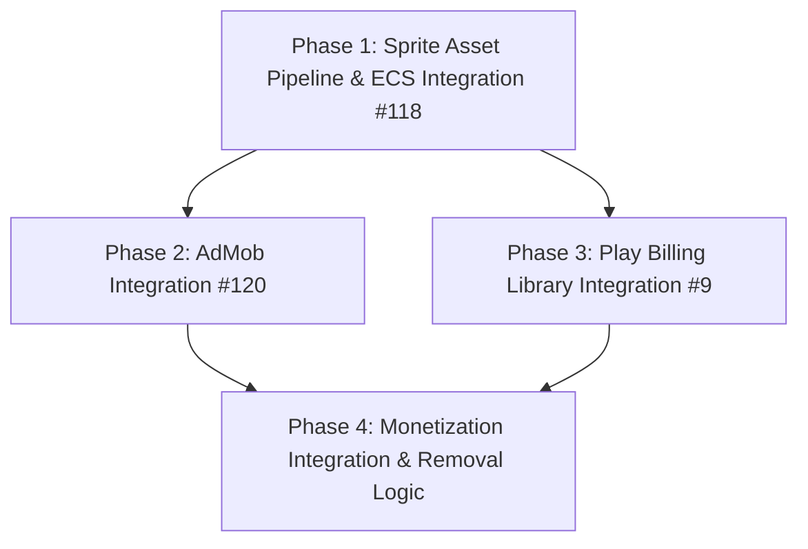

# Survivor TD: Implementation Plan for Sprites, Ads, and Billing

This document outlines the architecture, pipeline, and execution strategies for **Issue #118 (Sprite Asset Pipeline)**, **Issue #120 (AdMob Integration)**, and **Issue #9 (Play Billing)** in *Survivor TD*. 

---

## 1. Implementation Phases & Timeline

To minimize integration risk and establish early visual feedback, features must be implemented in the following sequence:



| Phase | Target Feature | Primary Focus | Dependencies | Est. Time |
| :--- | :--- | :--- | :--- | :--- |
| **Phase 1** | **Sprite Pipeline & ECS** | Core visual transition from primitives to sprite sheet animations. | None (Android Canvas API) | 4 Days |
| **Phase 2** | **AdMob Framework** | Initializing Mobile Ads SDK, layout design for ads, and Mocking. | Phase 1 (UI screens ready) | 3 Days |
| **Phase 3** | **Play Billing 7.x/8.x** | Purchasing "Remove Ads", coin packs, skins, and Mocking. | Phase 1 (Store UI ready) | 4 Days |
| **Phase 4** | **Monetization Sync** | Connecting Billing purchases to disable ads, grant skins/coins. | Phases 2 & 3 | 2 Days |

---

## 2. Issue #118: Sprite Asset Pipeline & ECS Integration

### Format & Compression Recommendation
* **Primary Format**: **WebP (Lossless)**. WebP reduces graphic storage size by 30-70% compared to PNG while retaining alpha transparency. Lossless is required for pixel art to avoid compression artifacts around fine edges.
* **Packaging Strategy**: **Texture Atlases (Sprite Sheets)**. 
  * Individual image files cause high memory overhead, garbage collection (GC) thrashing, and micro-stutters during level load and rendering because the GPU cannot batch drawing commands.
  * Pack sprites into a few **2048x2048px (or smaller)** WebP textures grouped by category: `heroes.webp`, `enemies.webp`, `effects.webp`.
* **Budget**: Maximum **30MB APK** size. Assets allocation: Sprites (10MB), Audio (12MB), Code/Libraries (8MB).

### Directory Structure & Naming Conventions
To prevent Android's compiler from scaling assets based on device density (which shifts pixel-perfect coordinates), sprite sheets must be placed in the `assets/` directory rather than `res/drawable-nodpi/`. 

```text
app/src/main/assets/
└── spritesheets/
    ├── heroes.webp             # Merged sprite sheets
    ├── heroes.json             # Frame metadata (x, y, width, height, anchor positions)
    ├── enemies.webp
    ├── enemies.json
    ├── effects.webp
    └── effects.json
```

**Naming Convention for Sprites**:
`[category]_[entity_type]_[action]_[frame_index]`  
*Examples*: `enemy_zombie_walk_0`, `hero_knight_idle_3`, `effect_fireball_fly_1`

### Sprite Tooling Stack
1. **Aseprite**: The industry-standard pixel art editor. Used to draw entities and animate frames.
2. **TexturePacker**: Command-line integration to pack individual frames into categorized atlases. Configured with:
   * **Border Padding**: `2px` to prevent texture bleeding.
   * **Algorithm**: MaxRects (best density packing).
   * **Format**: JSON Hash.

---

### ECS Component Arrays & Systems (60Hz Canvas Loop)

In a flat-array Entity Component System (ECS), components are parallel arrays of primitives. We avoid object allocation during updates.

#### Class Path: [SpriteManager.kt](file:///C:/Users/plner/AndroidStudioProjects/gravityWell/GravityWell/simpleGame/app/src/main/java/com/survivortd/game/core/assets/SpriteManager.kt)
```kotlin
package com.survivortd.game.core.assets

import android.content.Context
import android.graphics.Bitmap
import android.graphics.BitmapFactory
import android.graphics.Rect
import kotlinx.coroutines.Dispatchers
import kotlinx.coroutines.withContext
import org.json.JSONObject

class SpriteRegion(
    val x: Int,
    val y: Int,
    val width: Int,
    val height: Int,
    val pivotX: Int = width / 2,
    val pivotY: Int = height / 2
)

class TextureAtlas(val bitmap: Bitmap, val regions: Map<String, SpriteRegion>) {
    fun getRegion(key: String): SpriteRegion? = regions[key]
}

class SpriteManager(private val context: Context) {
    private val atlases = mutableMapOf<Int, TextureAtlas>()
    
    // Animation definition mappings
    private val animations = mutableMapOf<Int, Map<Int, AnimationDef>>()

    class AnimationDef(
        val frames: Array<String>,
        val frameDuration: Float, // in seconds
        val frameCount: Int = frames.size
    )

    companion object {
        const val ATLAS_HEROES = 0
        const val ATLAS_ENEMIES = 1
        const val ATLAS_EFFECTS = 2
        
        const val ANIM_IDLE = 0
        const val ANIM_WALK = 1
        const val ANIM_DEATH = 2
    }

    suspend fun loadAtlas(atlasId: Int, webpPath: String, jsonPath: String) = withContext(Dispatchers.IO) {
        val options = BitmapFactory.Options().apply {
            inPreferredConfig = Bitmap.Config.HARDWARE // Loaded directly to GPU, saving JVM Heap
        }
        val bitmap = context.assets.open(webpPath).use { BitmapFactory.decodeStream(it, null, options) }
            ?: throw IllegalArgumentException("Could not load bitmap: $webpPath")

        val jsonStr = context.assets.open(jsonPath).bufferedReader().use { it.readText() }
        val root = JSONObject(jsonStr)
        val framesJson = root.getJSONObject("frames")
        
        val regions = mutableMapOf<String, SpriteRegion>()
        framesJson.keys().forEach { key ->
            val frameData = framesJson.getJSONObject(key).getJSONObject("frame")
            regions[key] = SpriteRegion(
                x = frameData.getInt("x"),
                y = frameData.getInt("y"),
                width = frameData.getInt("w"),
                height = frameData.getInt("h")
            )
        }

        atlases[atlasId] = TextureAtlas(bitmap, regions)
    }

    fun getAtlas(atlasId: Int): TextureAtlas? = atlases[atlasId]
    
    fun getAnimation(spriteId: Int, stateId: Int): AnimationDef? = animations[spriteId]?.get(stateId)

    fun registerAnimation(spriteId: Int, stateId: Int, animDef: AnimationDef) {
        val states = animations.getOrPut(spriteId) { mutableMapOf() }
        (states as MutableMap)[stateId] = animDef
    }
}
```

#### Class Path: [SpriteAnimationSystem.kt](file:///C:/Users/plner/AndroidStudioProjects/gravityWell/GravityWell/simpleGame/app/src/main/java/com/survivortd/game/core/ecs/system/SpriteAnimationSystem.kt)
```kotlin
package com.survivortd.game.core.ecs.system

import com.survivortd.game.core.assets.SpriteManager

class SpriteAnimationSystem(
    private val spriteManager: SpriteManager,
    private val maxEntities: Int
) {
    // Parallel Component Arrays
    val entityActive = BooleanArray(maxEntities)
    val componentSpriteId = IntArray(maxEntities)      // Reference to Sprite ID
    val componentAnimState = IntArray(maxEntities)     // WALK, IDLE, etc.
    val componentFrameIndex = IntArray(maxEntities)    // Current active frame index
    val componentAnimTime = FloatArray(maxEntities)     // Elapsed duration for current frame
    val componentFrameKey = Array<String?>(maxEntities) { null } // Points to active atlas texture region

    fun update(dt: Float) {
        for (i in 0 until maxEntities) {
            if (!entityActive[i]) continue
            
            val spriteId = componentSpriteId[i]
            val animState = componentAnimState[i]
            val animDef = spriteManager.getAnimation(spriteId, animState) ?: continue
            
            var animTime = componentAnimTime[i] + dt
            var frameIdx = componentFrameIndex[i]
            val duration = animDef.frameDuration

            if (animTime >= duration) {
                frameIdx = (frameIdx + 1) % animDef.frameCount
                animTime -= duration
                
                componentFrameIndex[i] = frameIdx
                componentAnimTime[i] = animTime
                componentFrameKey[i] = animDef.frames[frameIdx]
            } else {
                componentAnimTime[i] = animTime
            }
        }
    }
}
```

#### Class Path: [RenderSystem.kt](file:///C:/Users/plner/AndroidStudioProjects/gravityWell/GravityWell/simpleGame/app/src/main/java/com/survivortd/game/core/ecs/system/RenderSystem.kt)
```kotlin
package com.survivortd.game.core.ecs.system

import android.graphics.Rect
import androidx.compose.ui.graphics.Canvas
import androidx.compose.ui.graphics.nativeCanvas
import com.survivortd.game.core.assets.SpriteManager

class RenderSystem(
    private val spriteManager: SpriteManager,
    private val positionsX: FloatArray,
    private val positionsY: FloatArray,
    private val entitySizes: FloatArray,
    private val maxEntities: Int
) {
    private val srcRect = Rect()
    private val dstRect = Rect()

    fun draw(canvas: Canvas, animSystem: SpriteAnimationSystem) {
        val nativeCanvas = canvas.nativeCanvas

        for (i in 0 until maxEntities) {
            if (!animSystem.entityActive[i]) continue

            val spriteId = animSystem.componentSpriteId[i]
            val frameKey = animSystem.componentFrameKey[i] ?: continue
            val atlas = spriteManager.getAtlas(spriteId) ?: continue
            val region = atlas.getRegion(frameKey) ?: continue

            val x = positionsX[i]
            val y = positionsY[i]
            val size = entitySizes[i]
            val halfSize = size / 2f

            // Map texture coordinates from atlas WebP
            srcRect.set(region.x, region.y, region.x + region.width, region.y + region.height)

            // Scale bounding box layout on screen Canvas
            dstRect.set(
                (x - halfSize).toInt(),
                (y - halfSize).toInt(),
                (x + halfSize).toInt(),
                (y + halfSize).toInt()
            )

            // Optimized batch rendering (hardware canvas reads directly from GPU memory)
            nativeCanvas.drawBitmap(atlas.bitmap, srcRect, dstRect, null)
        }
    }
}
```

---

## 3. Issue #120: AdMob Integration (Rewarded & Interstitial Ads)

### COPPA & Policy Compliance
Under Google Play Policy, apps targeting families or child players must set strict request limits:
1. Set child-directed configurations (`tagForChildDirectedTreatment`).
2. Cap Interstitial ads: Limit to **one ad per 5 minutes**, and only between distinct gameplay runs (never during active waves).

### Class Path: [AdManager.kt](file:///C:/Users/plner/AndroidStudioProjects/gravityWell/GravityWell/simpleGame/app/src/main/java/com/survivortd/game/monetization/ad/AdManager.kt)
```kotlin
package com.survivortd.game.monetization.ad

import android.app.Activity

interface AdManager {
    fun initialize()
    fun loadRewardedAd(adUnitId: String)
    fun showRewardedAd(activity: Activity, onRewardEarned: (amount: Int) -> Unit, onAdFailed: () -> Unit)
    fun loadInterstitialAd(adUnitId: String)
    fun showInterstitialAd(activity: Activity, onClosed: () -> Unit)
    fun isInterstitialReady(): Boolean
    fun isRewardedReady(): Boolean
}
```

#### Class Path: [AdMobAdManager.kt](file:///C:/Users/plner/AndroidStudioProjects/gravityWell/GravityWell/simpleGame/app/src/main/java/com/survivortd/game/monetization/ad/AdMobAdManager.kt)
```kotlin
package com.survivortd.game.monetization.ad

import android.app.Activity
import android.content.Context
import com.google.android.gms.ads.AdRequest
import com.google.android.gms.ads.LoadAdError
import com.google.android.gms.ads.MobileAds
import com.google.android.gms.ads.RequestConfiguration
import com.google.android.gms.ads.interstitial.InterstitialAd
import com.google.android.gms.ads.interstitial.InterstitialAdLoadCallback
import com.google.android.gms.ads.rewarded.RewardedAd
import com.google.android.gms.ads.rewarded.RewardedAdLoadCallback
import java.util.Collections

class AdMobAdManager(private val context: Context) : AdManager {
    private var rewardedAd: RewardedAd? = null
    private var interstitialAd: InterstitialAd? = null
    private var isAdFreeUser = false // Read from local encrypted DataStore in Phase 4

    override fun initialize() {
        // COPPA Compliance: Tag ad requests for child-directed treatment
        val requestConfig = RequestConfiguration.Builder()
            .setTagForChildDirectedTreatment(RequestConfiguration.TAG_FOR_CHILD_DIRECTED_TREATMENT_TRUE)
            .setMaxAdContentRating(RequestConfiguration.MAX_AD_CONTENT_RATING_G) // General audience
            .build()
        MobileAds.setRequestConfiguration(requestConfig)
        
        MobileAds.initialize(context) {}
    }

    override fun loadRewardedAd(adUnitId: String) {
        val adRequest = AdRequest.Builder().build()
        RewardedAd.load(context, adUnitId, adRequest, object : RewardedAdLoadCallback() {
            override fun onAdLoaded(ad: RewardedAd) {
                rewardedAd = ad
            }
            override fun onAdFailedToLoad(error: LoadAdError) {
                rewardedAd = null
            }
        })
    }

    override fun showRewardedAd(activity: Activity, onRewardEarned: (amount: Int) -> Unit, onAdFailed: () -> Unit) {
        val ad = rewardedAd
        if (ad != null) {
            ad.show(activity) { rewardItem ->
                onRewardEarned(rewardItem.amount)
            }
            rewardedAd = null // Consume
        } else {
            onAdFailed()
        }
    }

    override fun loadInterstitialAd(adUnitId: String) {
        if (isAdFreeUser) return
        val adRequest = AdRequest.Builder().build()
        InterstitialAd.load(context, adUnitId, adRequest, object : InterstitialAdLoadCallback() {
            override fun onAdLoaded(ad: InterstitialAd) {
                interstitialAd = ad
            }
            override fun onAdFailedToLoad(error: LoadAdError) {
                interstitialAd = null
            }
        })
    }

    override fun showInterstitialAd(activity: Activity, onClosed: () -> Unit) {
        if (isAdFreeUser) {
            onClosed()
            return
        }
        val ad = interstitialAd
        if (ad != null) {
            ad.show(activity)
            interstitialAd = null // Consume
            onClosed()
        } else {
            onClosed()
        }
    }

    override fun isInterstitialReady(): Boolean = interstitialAd != null && !isAdFreeUser
    override fun isRewardedReady(): Boolean = rewardedAd != null
    
    fun setAdFreeStatus(adFree: Boolean) {
        isAdFreeUser = adFree
    }
}
```

#### Class Path: [MockAdManager.kt](file:///C:/Users/plner/AndroidStudioProjects/gravityWell/GravityWell/simpleGame/app/src/main/java/com/survivortd/game/monetization/ad/MockAdManager.kt)
```kotlin
package com.survivortd.game.monetization.ad

import android.app.Activity
import android.util.Log

/**
 * Used for developer builds to simulate ad callbacks safely 
 * without making network requests or risking AdMob ban for self-clicks.
 */
class MockAdManager : AdManager {
    override fun initialize() { Log.d("MockAd", "Ad SDK Initialized") }
    override fun loadRewardedAd(adUnitId: String) {}
    override fun showRewardedAd(activity: Activity, onRewardEarned: (amount: Int) -> Unit, onAdFailed: () -> Unit) {
        // Instantly grant reward during development
        onRewardEarned(1)
    }
    override fun loadInterstitialAd(adUnitId: String) {}
    override fun showInterstitialAd(activity: Activity, onClosed: () -> Unit) { onClosed() }
    override fun isInterstitialReady(): Boolean = true
    override fun isRewardedReady(): Boolean = true
}
```

---

## 4. Issue #9: Google Play Billing Integration (IAP)

This integration follows Play Billing Library (PBL) 7.x/8.x requirements, utilizing dynamic reconnection, `ProductDetails` models, and modern parameters.

### Class Path: [BillingRepository.kt](file:///C:/Users/plner/AndroidStudioProjects/gravityWell/GravityWell/simpleGame/app/src/main/java/com/survivortd/game/monetization/billing/BillingRepository.kt)
```kotlin
package com.survivortd.game.monetization.billing

import android.app.Activity
import com.android.billingclient.api.ProductDetails
import com.android.billingclient.api.Purchase
import kotlinx.coroutines.flow.StateFlow

interface BillingRepository {
    val purchases: StateFlow<List<Purchase>>
    val isAdFreePurchased: StateFlow<Boolean>
    fun startConnection()
    fun queryProducts(productIds: List<String>, onResult: (List<ProductDetails>) -> Unit)
    fun launchPurchaseFlow(activity: Activity, productDetails: ProductDetails)
}
```

#### Class Path: [PlayBillingRepository.kt](file:///C:/Users/plner/AndroidStudioProjects/gravityWell/GravityWell/simpleGame/app/src/main/java/com/survivortd/game/monetization/billing/PlayBillingRepository.kt)
```kotlin
package com.survivortd.game.monetization.billing

import android.app.Activity
import android.content.Context
import com.android.billingclient.api.*
import kotlinx.coroutines.CoroutineScope
import kotlinx.coroutines.Dispatchers
import kotlinx.coroutines.flow.MutableStateFlow
import kotlinx.coroutines.flow.StateFlow
import kotlinx.coroutines.flow.asStateFlow
import kotlinx.coroutines.launch

class PlayBillingRepository(
    private val context: Context,
    private val scope: CoroutineScope
) : BillingRepository, PurchasesUpdatedListener {

    private var billingClient: BillingClient? = null

    private val _purchases = MutableStateFlow<List<Purchase>>(emptyList())
    override val purchases: StateFlow<List<Purchase>> = _purchases.asStateFlow()

    private val _isAdFreePurchased = MutableStateFlow(false)
    override val isAdFreePurchased: StateFlow<Boolean> = _isAdFreePurchased.asStateFlow()

    companion object {
        const val PRODUCT_REMOVE_ADS = "remove_ads_non_consumable"
        const val PRODUCT_COINS_PACK = "coins_pack_consumable"
    }

    override fun startConnection() {
        // PBL 8+ Reconnection handling is managed library-side using enableAutoServiceReconnection
        billingClient = BillingClient.newBuilder(context)
            .setListener(this)
            .enableAutoServiceReconnection() 
            .enablePendingPurchases(
                PendingPurchaseParams.newBuilder()
                    .enableOneTimeProducts() // Handles cash/bank delayed transfers
                    .build()
            )
            .build()

        billingClient?.startConnection(object : BillingClientStateListener {
            override fun onBillingSetupFinished(billingResult: BillingResult) {
                if (billingResult.responseCode == BillingClient.BillingResponseCode.OK) {
                    queryActivePurchases()
                }
            }
            override fun onBillingServiceDisconnected() {
                // Handled automatically via enableAutoServiceReconnection()
            }
        })
    }

    override fun queryProducts(productIds: List<String>, onResult: (List<ProductDetails>) -> Unit) {
        val productList = productIds.map { id ->
            QueryProductDetailsParams.Product.newBuilder()
                .setProductId(id)
                .setProductType(BillingClient.ProductType.INAPP)
                .build()
        }

        val params = QueryProductDetailsParams.newBuilder()
            .setProductList(productList)
            .build()

        billingClient?.queryProductDetailsAsync(params) { billingResult, productDetailsList ->
            if (billingResult.responseCode == BillingClient.BillingResponseCode.OK) {
                onResult(productDetailsList)
            } else {
                onResult(emptyList())
            }
        }
    }

    override fun launchPurchaseFlow(activity: Activity, productDetails: ProductDetails) {
        val flowParams = BillingFlowParams.newBuilder()
            .setProductDetailsParamsList(
                listOf(
                    BillingFlowParams.ProductDetailsParams.newBuilder()
                        .setProductDetails(productDetails)
                        .build()
                )
            )
            .build()

        billingClient?.launchBillingFlow(activity, flowParams)
    }

    override fun onPurchasesUpdated(billingResult: BillingResult, purchasesList: List<Purchase>?) {
        if (billingResult.responseCode == BillingClient.BillingResponseCode.OK && purchasesList != null) {
            _purchases.value = purchasesList
            scope.launch(Dispatchers.IO) {
                handlePurchases(purchasesList)
            }
        }
    }

    private suspend fun handlePurchases(purchasesList: List<Purchase>) {
        for (purchase in purchasesList) {
            if (purchase.purchaseState == Purchase.PurchaseState.PURCHASED) {
                if (!purchase.isAcknowledged) {
                    // Non-consumables must be acknowledged within 3 days to avoid refund
                    if (purchase.products.contains(PRODUCT_REMOVE_ADS)) {
                        val acknowledgeParams = AcknowledgePurchaseParams.newBuilder()
                            .setPurchaseToken(purchase.purchaseToken)
                            .build()
                        billingClient?.acknowledgePurchase(acknowledgeParams) { result ->
                            if (result.responseCode == BillingClient.BillingResponseCode.OK) {
                                _isAdFreePurchased.value = true
                            }
                        }
                    } else if (purchase.products.contains(PRODUCT_COINS_PACK)) {
                        // Consumables must be consumed to allow buying again
                        val consumeParams = ConsumeParams.newBuilder()
                            .setPurchaseToken(purchase.purchaseToken)
                            .build()
                        billingClient?.consumeAsync(consumeParams) { result, _ ->
                            if (result.responseCode == BillingClient.BillingResponseCode.OK) {
                                // Grant coins to player
                            }
                        }
                    }
                }
            }
        }
    }

    private fun queryActivePurchases() {
        val params = QueryPurchasesParams.newBuilder()
            .setProductType(BillingClient.ProductType.INAPP)
            .build()

        billingClient?.queryPurchasesAsync(params) { billingResult, purchasesList ->
            if (billingResult.responseCode == BillingClient.BillingResponseCode.OK) {
                _purchases.value = purchasesList
                val isAdFree = purchasesList.any { 
                    it.products.contains(PRODUCT_REMOVE_ADS) && it.purchaseState == Purchase.PurchaseState.PURCHASED 
                }
                _isAdFreePurchased.value = isAdFree
            }
        }
    }
}
```

#### Class Path: [MockBillingRepository.kt](file:///C:/Users/plner/AndroidStudioProjects/gravityWell/GravityWell/simpleGame/app/src/main/java/com/survivortd/game/monetization/billing/MockBillingRepository.kt)
```kotlin
package com.survivortd.game.monetization.billing

import android.app.Activity
import com.android.billingclient.api.ProductDetails
import com.android.billingclient.api.Purchase
import kotlinx.coroutines.flow.MutableStateFlow
import kotlinx.coroutines.flow.StateFlow
import kotlinx.coroutines.flow.asStateFlow

/**
 * Used for developer/sandbox environments to test UI states 
 * and purchase updates without talking to Play Services.
 */
class MockBillingRepository : BillingRepository {
    private val _purchases = MutableStateFlow<List<Purchase>>(emptyList())
    override val purchases: StateFlow<List<Purchase>> = _purchases.asStateFlow()

    private val _isAdFreePurchased = MutableStateFlow(false)
    override val isAdFreePurchased: StateFlow<Boolean> = _isAdFreePurchased.asStateFlow()

    override fun startConnection() {}

    override fun queryProducts(productIds: List<String>, onResult: (List<ProductDetails>) -> Unit) {
        // Return dummy details
        onResult(emptyList())
    }

    override fun launchPurchaseFlow(activity: Activity, productDetails: ProductDetails) {
        // Simulate immediate success
        if (productDetails.productId == PlayBillingRepository.PRODUCT_REMOVE_ADS) {
            _isAdFreePurchased.value = true
        }
    }

    fun forceSetAdFree(purchased: Boolean) {
        _isAdFreePurchased.value = purchased
    }
}
```

---

## 5. Monetization Flow Integration (Phase 4 Sync)

### When to Trigger Ads & Mock Logic
To guarantee non-obtrusive gameplay:
* **Rewarded Ad (Revive)**: Showed exclusively on player death. If player clicks "Revive", pause game updates, display full-screen AdMob callback, revive on success, else trigger Game Over screen.
* **Interstitial Ad (End of Run)**: Triggered only if player hasn't watched a rewarded ad in the same session, and the 5-minute global cooldown has expired.

```
       Gameplay Loop
            │
      [Player Dies]
            │
    Is Rewarded Ad Ready?
     ├── Yes ──> Prompt "Watch Ad to Revive?" ──> [Yes] ──> Play Ad ──> [Success] ──> Revive player with 50% HP
     │                                                                   └── [Fail] ───> Transition to game over
     └── No ───────────────────────────────────────────────────────────────────────────> Transition to game over
                                                                                               │
                                                                                    Is Interstitial Cooldown Active?
                                                                                     ├── Yes ──> Skip Interstitial
                                                                                     └── No ───> Play Interstitial Ad
```
